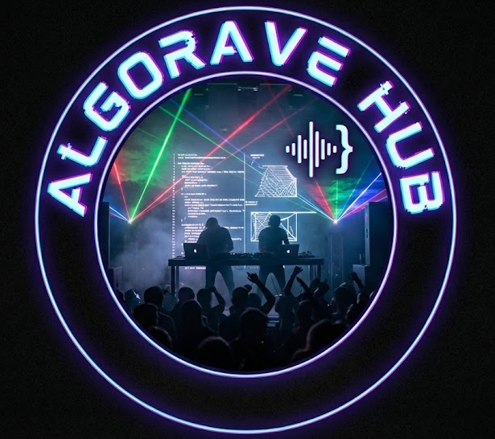
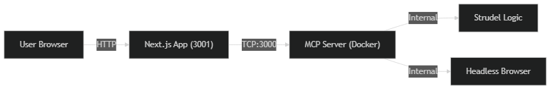

# Algorave Hub

A central hub for algoraving with Strudel, powered by AI and Model Context Protocol.

[https://github.com/alienmind/algorave](https://github.com/alienmind/algorave)



# 🏗️ Architecture



- **Web App**: Next.js (React) front-end for prompts and playback.
- **MCP Server**: Custom Strudel MCP Server for music generation logic.
- **Docker**: Containerized environment for reproducibility.

# 🚀 Getting Started

**Prerequisites**

- Node.js (v18+)
- Docker (Optional, for containerized run)

## Installation

```bash
npm install
npm run build
```

## Running

### Option 1: Local (Default)

Running locally is faster for development and doesn't require Docker.

```bash
npm start
```
This starts the web app at [http://localhost:3001](http://localhost:3001) and spawns the MCP server as a subprocess.

### Option 2: Docker

To run the entire stack in isolated containers:

```bash
npm run docker:up
```

## Stopping

To stop the Docker containers:

```bash
npm stop
# or
npm run docker:down
```

# ⚙️ Configuration

**Local Strudel Instance (Airgapped Mode)**

You can run a local instance of Strudel (e.g. for offline usage) instead of `strudel.cc`.

1.  **Enable Local Strudel**:
    -   **For Local Run**: Create `web/.env` and add:
        ```bash
        NEXT_PUBLIC_USE_LOCAL_STRUDEL=true
        ```
    -   **For Docker Run**:
        The `docker-compose.yml` is configured to use `false` (external) by default. To change it, set the environment variable before building:
        ```bash
        NEXT_PUBLIC_USE_LOCAL_STRUDEL=true npm run docker:up -- --build
        ```
    
2.  **Access**:
    -   Web App: http://localhost:3001
    -   Strudel (Direct): http://localhost:4321

# 🎵 Usage

1.  **Start the App** (Local or Docker).
2.  **Open** [http://localhost:3001](http://localhost:3001).
3.  **Generate Music**:
    -   Enter a style (e.g., "techno", "house", "dnb").
    -   Click "Algorave!".
    -   Wait for the code to generate and the Strudel player to load.

# 🛠️ Development

- **VS Code DevContainer**: Open this folder in VS Code and click "Reopen in Container" for a configured environment.
- `npm run docker:up`: Start everything in Docker.
- `npm start`: Start locally in dev mode.
- `npm run docs`: Generate this presentation (Reveal.js).

# 🔮 Future Improvements

- [ ] Add easy to pick up music code examples
- [ ] Connect the chat prompt to an actual LLM (Claude, Gemini or ChatGPT) for smarter code generation
- [ ] Allow locally hosting an LLM with ollama
- [ ] Add visuals

# Credits

- Strudel: [strudel.cc](https://strudel.cc)
- Strudel MCP Server: [github.com/williamzujkowski/strudel-mcp-server](https://github.com/williamzujkowski/strudel-mcp-server)
