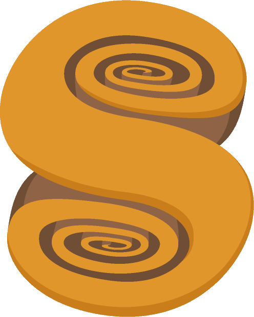
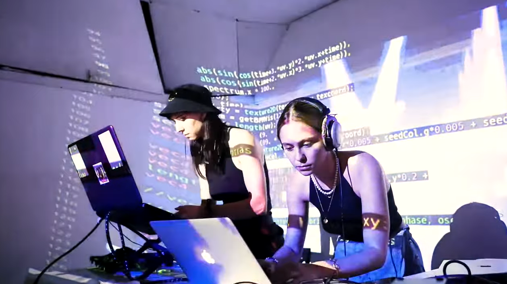
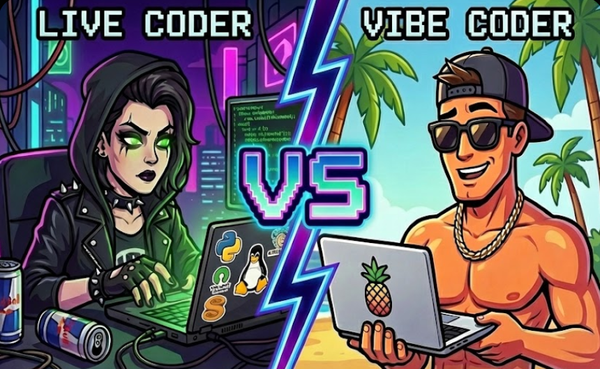
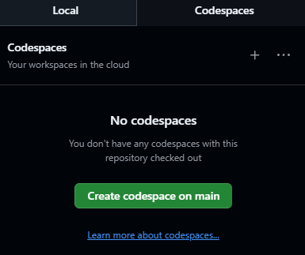
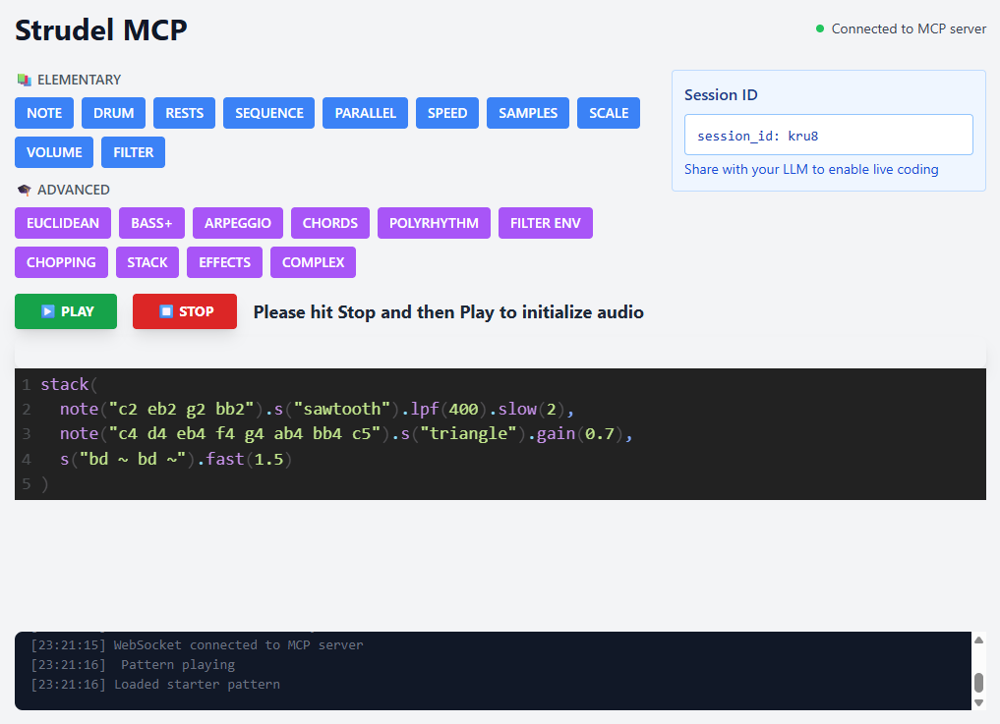
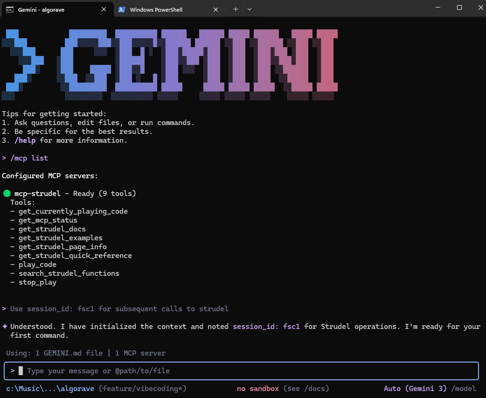

# 🌀 Strudel / Algorave Workshop



A **1-hour workshop** exploring how to create music with code using Strudel.

## 🔗 Links

**Strudel**: [https://strudel.cc](https://strudel.cc) || [Self-hosted option](https://alienmind.github.io/algorave/strudel/)
(install the PWA for best performance)

**Site Gallery / Tutorial**: [https://strudel.patternclub.org/workshop/site-gallery](https://strudel.patternclub.org/workshop/site-gallery)

**More Examples!**: [https://github.com/alienmind/algorave/tree/main/examples](https://github.com/alienmind/algorave/tree/main/examples)

**This presentation**: [https://alienmind.github.io/algorave/presentation.html#/algorave-strudel-workshop](https://alienmind.github.io/algorave/presentation.html#/algorave-strudel-workshop)

---

## 📅 Schedule

*   **[08 mins]** **Introduction**: Algorave Culture & Context
*   **[20 mins]** **Part 1: The Basics & Demo**: Walkthrough of core functionalities
*   **[20 mins]** **Part 2a: Vibecoders track**: If you just wanna play with LLM+MCP (*BYOK!*)
*   **[20 mins]** **Part 2b: Livecoders track**: If you already know some music
*   **[02 mins]** **Part 3: Strudel Awards**: maybe ;-)

---

## 📚 Introduction

### What is Strudel?

<div style="display: flex; justify-content: space-around; align-items: center;">

</div>

*   **Web-based Live Coding**: A port of **TidalCycles** (Haskell) to JavaScript - Open Source and community-driven!
*   **Zero Footprint**: No installation required!
*   **Portability**: Make music anywhere, on any device with a browser.

---

### ❔Why Algorave?

**Algorithm + Rave = Algorave**

*   **Live Creation**: Music and visuals generated in real-time.
*   **Transparency**: "Show us your screens" - the code is part of the performance.
*   **Diverse Tooling**: While we use Strudel, others perform with **TidalCycles**, **SonicPi**, **SuperCollider**, etc.
*   **Visuals**: Optional! Often coded live using **[Hydra](https://hydra.ojack.xyz/)**, **[P5.js](https://p5js.org/)**, etc.

<div style="text-align: center;">
<a href="https://www.youtube.com/watch?v=7qfCeIgtllY?t=140" target="_blank">
  
</a>
<p style="font-size: small; margin-top: 0;">DJ_Dave & Char Stiles Livecoding Performance @ Algowave Algorave, 2021</p>
</div>

---

### 🚧 Side note - Algorave Hub (WIP)

I'm working on a side project - that integrates strudel knowledge base + LLM+MCP powered "composition" for "vibe" music coding.
[https://github.com/alienmind/algorave](https://github.com/alienmind/algorave)


Unfortunately not ready yet! - **Stay tuned for the next workshop!**

> **PLAN FOR TODAY**: real livecoding and/or "some" vibe coding (w/ alternative implementation)

---

## 📖 Tutorial

> **Follow along here**: [http://strudel.patternclub.org/workshop/site-gallery](http://strudel.patternclub.org/workshop/site-gallery)

1.  **The basics** - Making your first sounds + mininotation
2.  **Rhythms, Polyrythms**
3.  **Sound and Synths libraries**
4.  **Some more advanced examples**

---

### ✋ Livecoders vs 👇 Vibecoders

*   **Raise your hand** ✋ if you already know some music and wanna try livecoding.
*   **Lower your hand** 👇 if you don't know any music or wanna be part of the vibe coding team.

<div style="display: flex; justify-content: space-around; align-items: center;">
  
</div>

> **IN REALITY**: no need to choose, you can be both ;-)

---

## 🤖 Part 2a: Vibecoders Track

So you want to "vibecode" some Strudel?
Let's start by setting up an **SSE enabled MCP server**

*   **Calvin Williamson MCP-Strudel** - [Visit the web site](https://mcp-strudel.mcp.mathplosion.com/strudel/)
*   **SSE endpoint** - [https://mcp-strudel.mcp.mathplosion.com/sse/](https://mcp-strudel.mcp.mathplosion.com/sse/)

---

Skip next slide: if you want to reuse [my setup](https://github.com/alienmind/algorave) by using a [GitHub codespace](https://github.com/features/codespaces) / [devcontainer](https://containers.dev/)

Click on Code -> Codespaces -> Create codespace on main

<div style="display: flex; justify-content: space-around; align-items: center;">
  
</div>

---

## Setting up MCP server with Gemini CLI

Open your terminal and run:

<div style="display: flex; justify-content: space-around; align-items: center;">
```bash
$ npm install -g gemini-chat-cli@latest
```
</div>

Add the server to your configuration (~/.gemini/settings.json)
<div style="display: flex; justify-content: space-around; align-items: center;">
```json
{
  ...,
  "general": {
    "previewFeatures": true
  },
  "mcpServers": {
    "mcp-strudel": {
      "url": "https://mcp-strudel.mcp.mathplosion.com/sse/",
      "timeout": 30000,
      "trust": true
    }
  }
}
```
</div>

---

### Vibe coding session!

Open up side by side:

*   [MCP Strudel Website](https://mcp-strudel.mcp.mathplosion.com/strudel/)
*   Optionally: Use my [Strudel.cc fork](https://alienmind.github.io/algorave/strudel/) (or [Official Strudel.cc](https://strudel.cc/) - not accessible with corporate laptops)
*   Any terminal with Gemini CLI
*   Pick the session_id from MCP, paste it to LLM as first prompt: "Use session_id: xxxx for Strudel operations" so it can interact with MCP server window

<div style="display: flex; justify-content: space-around; align-items: center;">
  
  
</div>


**Try this prompt**: Try "Write an amazing house track using Strudel".

---

## 🎹 Part 2b: Livecoders Track


*   **Follow Along**: We will do some *real* livecoding. Feel free to copy what I do and modify it, or write your own!
*   **Experiment**: Explore the examples, change numbers, *upload new sounds*, break things...
*   **Resources**: Use the [examples](https://github.com/alienmind/algorave/tree/main/examples) or the [gallery](https://strudel.patternclub.org/workshop/site-gallery), more free sounds available in [freesound.org](https://freesound.org/)

Remember - ⚡ENERGY: YES! ✨QUALITY: NO! - you’re not looking for a perfect polished track, but something that feels good to you :)


---

## 🙋 Volunteers Jam & 🏆 Contest

Raise your hand if you wanna show what you've made!

---

## 🔗 References

Please see [REFERENCES.md](https://github.com/alienmind/algorave/blob/main/REFERENCES.md) for a complete list of links and resources used in this workshop.
